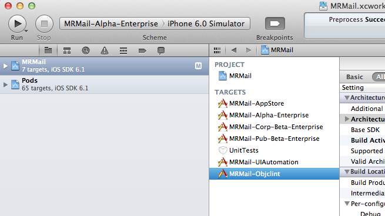

=====
Usage
=====

Simple usage
------------

Objclint currently is only usable via terminal. One command you will need is
::

    $ objclint-xcodebuild

It just proxy to **xcodebuild** command and accept any argument that **xcodebuild** accept.

Configuration file
------------------

By default **objclint** will use *./lints* folder for JS validation scripts and will analyze all files passed into during **xcodebuild** process. But it is possible to alter this behaviour, create **.objclint** file in the same folder as project file is. Here is example of possible configuration file
::

    {
        "lints-directories": ["./my-lints"],
        "ignores": [
            "src/infrastructure/blowfish/ablowfishv1.h$",
            "local-pods/.*",
            "Pods/.*",
            "thirdparty/.*"
        ]
    }

So **objclint** will look for JS lints in *./my-lints* folder and will ignore some files in listed folders.

Project configuration
---------------------

You should create seperate project target to ignore any resource file and don't perform analyzis twice for every supported platform.

Seperate target 'Objclint' copied from your main target.
~~~~~~~~~~~~~~~~~~~~~~~~~~~~~~~~~~~~~~~~~~~~~~~~~~~~~~~~

Only one architecture to build for.
~~~~~~~~~~~~~~~~~~~~~~~~~~~~~~~~~~~

No unnecessary build phases.
~~~~~~~~~~~~~~~~~~~~~~~~~~~~

